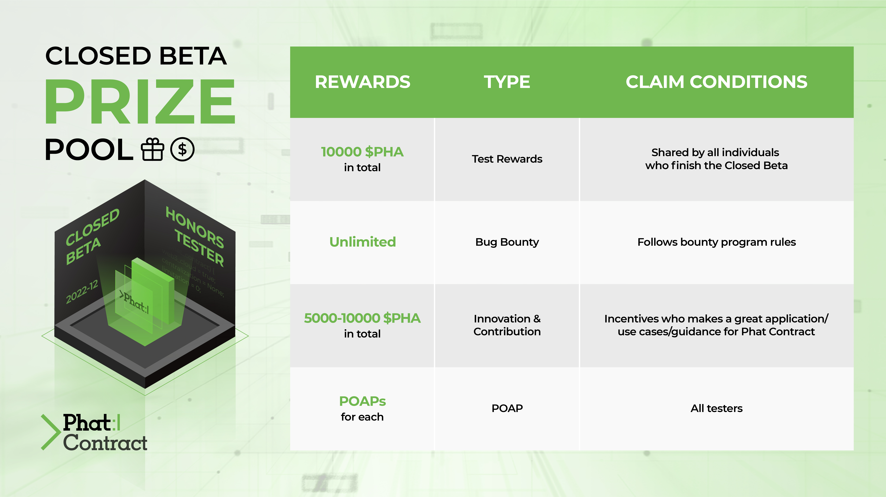

# Phat Contract Closed Beta Submission Repository

Phat Contract Closed Beta is launched before the release of [Phat Contract](https://wiki.phala.network/en-us/build/general/intro/) on Phala mainnet. The aim of it is to monitor the experience of developers, identify any potential issues, and then address them in order to improve the quality of our service.

Both Phala's partner projects and individual developers are involved in this test. The contents to experience in the Closed Beta is listed in our [wiki](https://wiki.phala.network/en-us/build/general/closed-beta/). Individual developers need to apply for the test first by filling in this [form](https://forms.gle/sbCDHfu7t9SNvytB7).

Phala proposes a Closed Beta prize pool to encourage the engagement,  and this repository is for individual developers to submit their projects to win the rewards.

> If you got any question, join our [Discord server](https://discord.gg/phala) and ask in the `💻｜dev` channel.

## Prize Pool Details

## 📅 Dates

- Start date: Jan 23rd, 23:59 EST
- Duration: 3 months
- End date: Apr 21st, 23:59 EST, **submission must be made before this**
- Judgement: 2 weeks
- Distribution of rewards: May 5th

## 🎁 Test Rewards

- **Rewards**: 10000 $PHA in total, shared by all the individuals who finish the Closed Beta
- **Requirements**
  - Deploy at least one Phat Contract to our Closed Beta testnet
  - Post a screenshot of using the [Phat Contract UI](https://phat-cb.phala.network/) to interact with your contract on Twitter
  - **Submit the following information as an Issue in this repository**
    - Your deployer account and deployed contract address
    > Due to the chain reset, please re-deploy if your last deployment is before Feb 26th
    - No need to submit the source code
    - The link to your tweet above
    - Your Discord handler, ensure you have already joined our [Discord server](https://discord.gg/phala)
    - Your reward receiver Khala account

## 🏆 Innovation Rewards

You don’t necessarily need to finish the whole application, but at least the complete design of the system and the implementation of the prototype should be done. We will judge the submissions based on the feasibility of the system design and the completeness.

- **Rewards**: 5000 - 10000 $PHA for each project depends on the innovation and quality
  - You are also encouraged to apply for the [Builders Program](https://wiki.phala.network/en-us/build/general/builders-program/) for further support
- **Requirements**
  - Submit the following information as Issue
    - Your deployer account and deployed MVP contract address
    - Your source code repository with system design and necessary documents
    - Your Discord handler, ensure you have already joined our [Discord server](https://discord.gg/phala)
    - Your reward receiver Khala account

## 🧰 Other Resources

- [Phala Wiki](https://wiki.phala.network)
  - [Closed Beta Main Page](https://wiki.phala.network/en-us/build/general/closed-beta/)
- [Phat Contract Examples](https://github.com/Phala-Network/phat-contract-examples)
- [Awesome Phat Contracts](https://github.com/Phala-Network/awesome-phat-contracts)
- Ideas from [previous Hackathon Submissions](https://github.com/Phala-Network/Encode-Hackathon-2021/issues/21)
- Codebase
  - [phala-blockchain](https://github.com/Phala-Network/phala-blockchain)
  - Development tool for Phat contracts [devPHAse](https://github.com/l00k/devphase)

## ☁️ About Phala Network

The vision of our Phala is to become the world’s largest P2P computing network, a standard decentralized computing cloud based on Web3. Compared with centralized solutions like Amazon Web Services, Microsoft Azure and Google Cloud Platform, trustless is not only the first feature of Phala recognized by the community but also the cornerstone of Phala becoming a reliable distributed computing network.

Some useful resources include:
- [Main page](https://phala.network/)
- [Phala Wiki](https://wiki.phala.network/en-us/) about Phala applications, mining and Phat Contract development
- [Discord channel](https://discord.gg/phala) and [Forum](https://forum.phala.network/) to discuss with us and our community members directly
- [Medium](https://medium.com/phala-network) and [Twitter](https://twitter.com/PhalaNetwork) to learn about our latest progress
